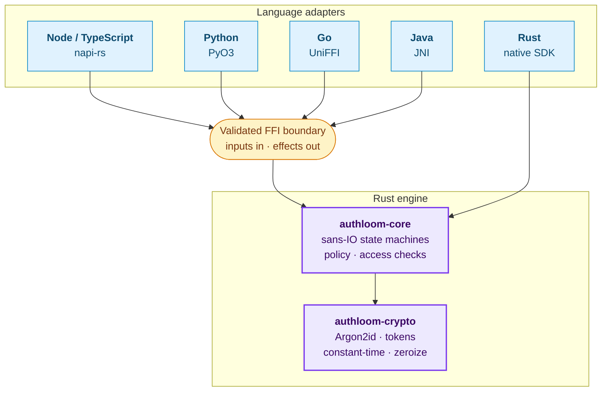
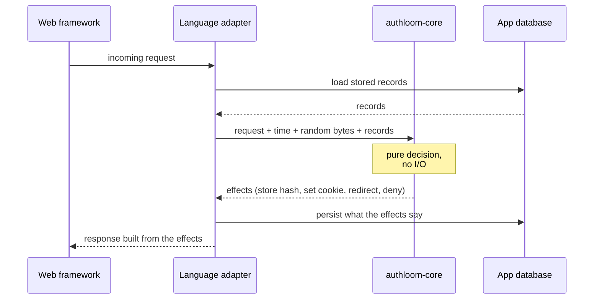
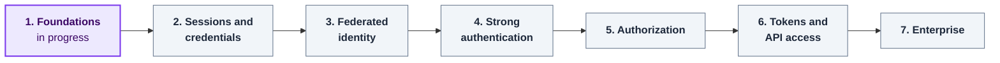
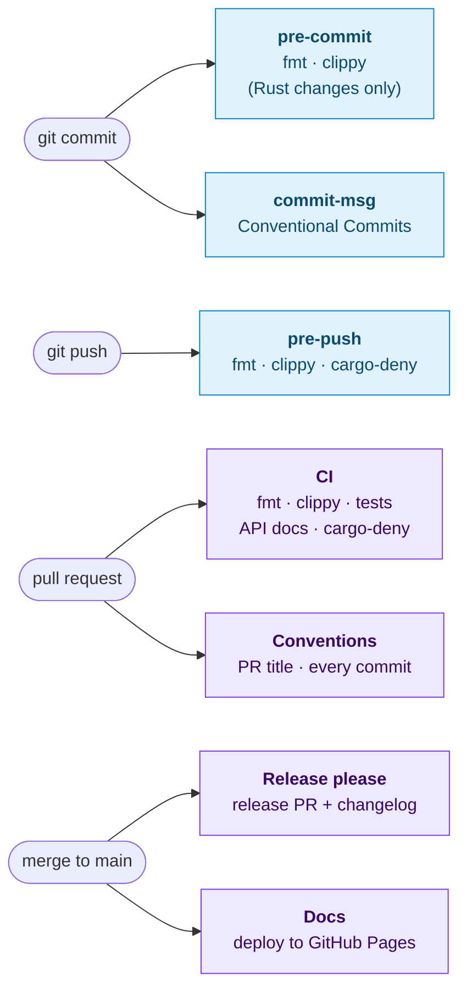

# Authloom

**An open-source authentication and authorization library, written once in Rust and usable from any language.**

> Status: early development (Phase 1, foundations). The workspace, tooling, CI and docs are in place, but no auth functionality is implemented yet. Nothing here is ready for production use.

## Mission

Auth is the part of an application where one small mistake costs the most. Right now every language ecosystem rebuilds it from scratch, and each rebuild brings its own session fixation bugs, timing leaks, weak token handling and OAuth mistakes.

Authloom aims to fix that by:

- **Writing the security logic once.** A single Rust core holds every security decision: password hashing, session rules, token validation, OAuth state, MFA enforcement and access checks.
- **Letting every language hook in.** Thin adapters for Node.js, Python and more expose that core through each language's native idioms and web frameworks.
- **Making sure adapters can't weaken it.** The core is sans-IO and makes the decisions itself. Adapters only move bytes. A shared conformance suite checks that every adapter behaves the same way on security.
- **Shipping secure defaults.** The safe choice needs no configuration. Any setting that weakens security has to be turned on explicitly and says so in its name.
- **Being checked against real standards.** The acceptance criteria come from the [OWASP ASVS](https://owasp.org/www-project-application-security-verification-standard/), NIST SP 800-63B and the relevant RFCs, not from our own opinions.

For an auth library, trust is the product. That's why threat modelling, fuzzing, supply-chain hygiene and external review are part of the project from the start rather than added at the end.

## Architecture



The Rust SDK calls the core directly. Every other adapter crosses an FFI boundary that validates what passes through it.

The core never does I/O itself. The adapter passes in a request, the current time, some random bytes and any stored records. The core sends back **effects** such as "set this cookie", "store this session hash", "redirect here" or "deny". The adapter carries those effects out using the host language's own database and HTTP stack.



This means:

- the security rules are the same in every language;
- every flow can be tested as a pure state transition, including with property tests and fuzzing;
- adding a new language is a small translation job, not a rewrite.

## Current state

| Area | State |
|---|---|
| `authloom-core`, `authloom-crypto` | Crates created with their module docs and `#![forbid(unsafe_code)]`. No functionality yet. |
| Adapters (Node, Python, Go, Java, Rust) | Crates created and wired to `authloom-core`. No bindings yet. |
| Conformance suite | Planned from Phase 2. [conformance/](conformance/) only has a README describing the contract. |
| Tooling | `make` task runner, dev container, `make branch` / `make commit` helpers and git hooks. |
| CI | Format, clippy, tests on Linux/macOS/Windows, API docs, cargo-deny, Conventional Commit checks, docs deploy and release-please. |
| Docs | Starlight docsite with get-started, concepts, adapters, security, project and decision-record pages, plus a generated API reference. |

## Repository layout

```
auth-loom/
├── crates/
│   ├── authloom-core/     # Sans-IO core: state machines, policy, effects
│   └── authloom-crypto/   # Hashing, token generation, constant-time ops, secrets
├── adapters/
│   ├── node/              # Node.js / TypeScript bindings (napi-rs)
│   ├── python/            # Python bindings (PyO3)
│   ├── go/                # Go bindings (UniFFI)
│   ├── java/              # Java bindings (JNI)
│   └── rust/              # Idiomatic Rust SDK over authloom-core
├── conformance/           # Shared black-box test suite every adapter must pass
├── tools/devtools/        # Branch, commit and hook tooling behind `make branch`, `make commit`, `make hooks`
├── .githooks/             # pre-commit, commit-msg and pre-push hooks
├── .github/workflows/     # CI, Conventions, Docs and Release please
├── docs/                  # Docsite (Starlight): guides, roadmap, API reference
│   └── src/content/docs/  # Hand-written pages: get started, concepts, adapters, security, project, decisions
├── CONTRIBUTING.md
├── SECURITY.md
└── LICENSE
```

## Roadmap

Each phase can ship on its own and relies only on the phases before it. See the [roadmap](docs/src/content/docs/project/roadmap.md) for the full plan.



| Phase | Scope | Milestone |
|---|---|---|
| 1. Foundations | Argon2id, secure tokens, constant-time comparison, secret handling, key rotation, sans-IO boundary | Core hashes and verifies passwords and tokens, and returns effects to a Node test harness |
| 2. Sessions and credentials | Email/password, server-side sessions, cookies, CSRF, rate limiting, verification, reset, magic links | Node and Python adapters sharing one core, both passing the same conformance suite |
| 3. Federated identity | OAuth 2.0 and OIDC as a client, PKCE, social providers, safe account linking | Two providers plus generic OIDC, modelled as pure state transitions |
| 4. Strong authentication | TOTP, recovery codes, MFA enforcement, passkeys/WebAuthn, step-up auth | Passwordless sign-up with passkeys, with MFA enforced in the core |
| 5. Authorization | RBAC, organisations and tenancy, typed permission schemas, ABAC, ReBAC | A single `check(subject, action, resource)` entry point, plus a cross-tenant attack suite |
| 6. Tokens and API access | JWTs, refresh token rotation, API keys, DPoP, device flow, OIDC provider mode | Passes the OpenID Foundation conformance tests |
| 7. Enterprise | SAML, SCIM, SSO enforcement, audit logging, admin and impersonation, GDPR erasure | SAML and SCIM working against Okta and Entra ID |

## Getting started

Everything runs through `make`. Run `make help` to list the targets.

**On your machine** (Rust 1.85 or newer):

```sh
make tools        # one-off: cargo-deny, cargo-fuzz, rustfmt and clippy
make hooks        # one-off: install the git hooks
make build
make check        # fmt, clippy and tests: what every PR must pass
make deny         # dependency advisories, licences and banned crates
```

**In Docker** (no local toolchains needed; includes Rust, Node and Python):

```sh
make docker-shell # a shell with every toolchain, repo mounted at /workspace
make docker-check # run the PR checks in the container
make docker-ci    # the full CI pipeline in a clean image build
```

### Checks

The same checks run locally through the git hooks and again in CI, so a push that passes locally should pass CI.



Skip a hook once with `--no-verify`. CI still runs the same checks.

## Documentation

The docsite in [docs/](docs/) combines hand-written guides with an API reference generated from the code: rustdoc for Rust, TypeDoc for TypeScript and griffe for Python. It's published to GitHub Pages from `main`.

```sh
make docs-serve   # http://localhost:4321; the API reference regenerates as you edit code
make docs-build   # static site in docs/dist, exactly as deployed
```

## Contributing

Contributions are welcome. Please read [CONTRIBUTING.md](CONTRIBUTING.md) first, because security-sensitive changes follow a specific workflow.

**Please don't report security vulnerabilities in public issues.** See [SECURITY.md](SECURITY.md).

## License

[MIT](LICENSE)
