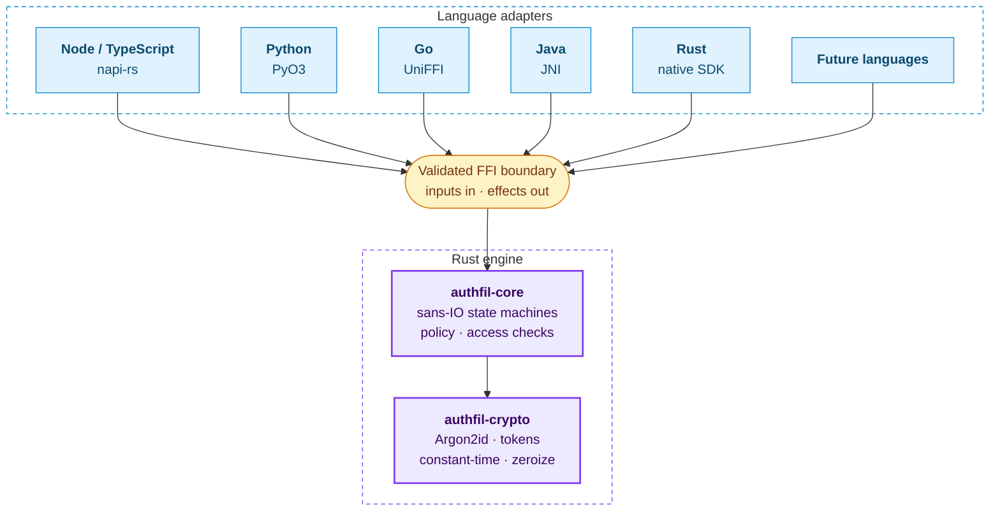
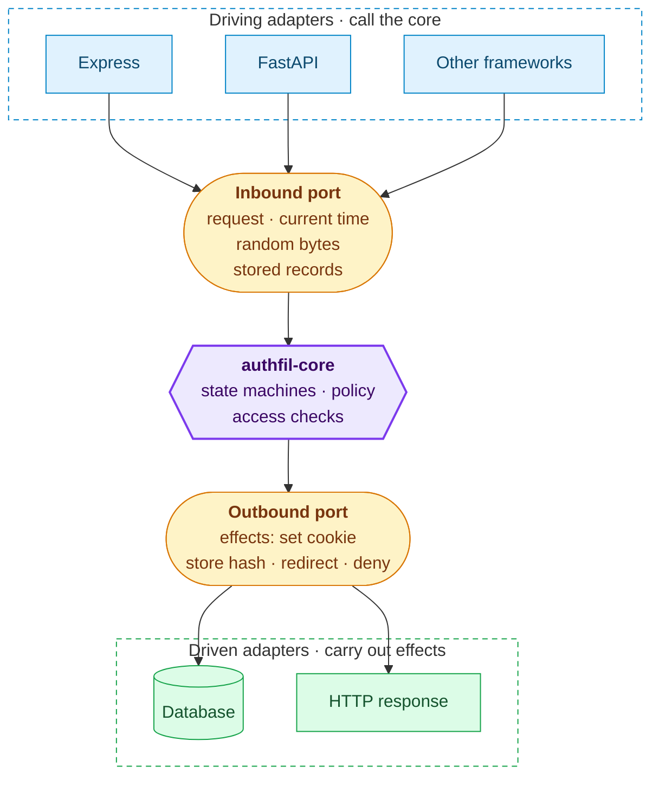

Authfil is one Rust engine with a thin adapter for each language. The engine makes every authentication and authorization decision. The adapters only translate.

## Hexagonal architecture

Authfil follows a ports-and-adapters (hexagonal) architecture. `authfil-core` is the hexagon: it owns every auth decision and exposes **ports** — the inputs it needs (a request, the current time, random bytes, stored records) and the effects it produces (set this cookie, store this session hash, deny). It never does I/O and never calls into a specific database or HTTP stack itself.

The colours are the same in both diagrams: blue for adapters, amber for ports, purple for the core and green for the infrastructure that adapters talk to. Click any diagram to enlarge it.

Everything outside the hexagon is an **adapter**: the Node, Python, Go, Java, Rust and future-language bindings plug into those ports, and framework integrations such as Express or FastAPI sit a layer further out again. Adapters translate between the host language's ecosystem and the core's ports — they never make auth decisions of their own.

The benefit of drawing the boundary this way is that the core has exactly one implementation of the rules, and adapters are interchangeable, testable in isolation, and can't drift from each other on security-relevant behaviour.

## Where to go next

- [The sans-IO core](../sans-io-core/): why the core never does I/O, and what that buys you.
- [The crypto crate](../crypto/): the primitives every feature is built on.
- [Adapters](../../adapters/): how each language plugs into the core's ports.
- [The conformance suite](../conformance/): the tests that hold every adapter to the same behaviour.
- [ADR 0001](../../decisions/0001-sans-io-core/): the decision record behind this design.
