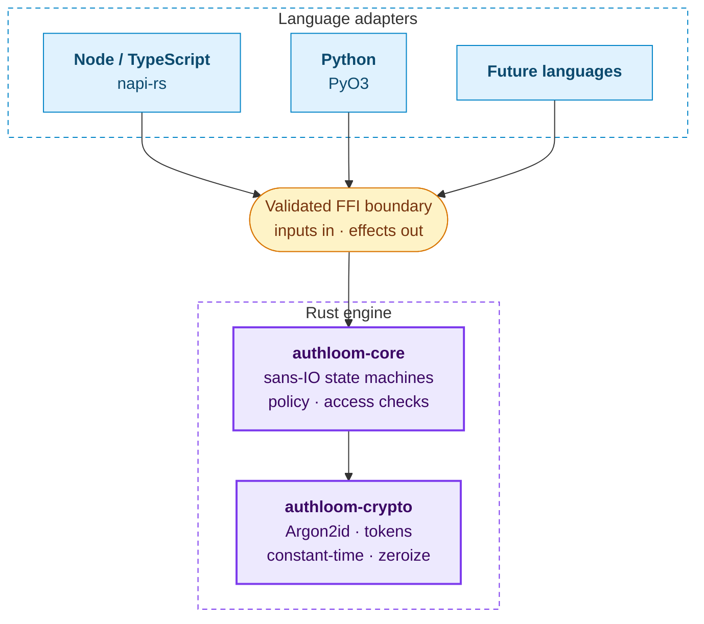
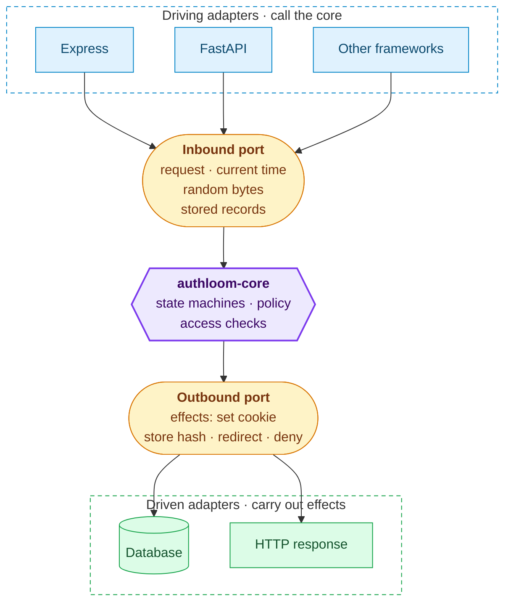

## Hexagonal architecture

Authloom follows a ports-and-adapters (hexagonal) architecture. `authloom-core` is the hexagon: it owns every auth decision and exposes **ports** — the inputs it needs (a request, the current time, random bytes, stored records) and the effects it produces (set this cookie, store this session hash, deny). It never does I/O and never calls into a specific database or HTTP stack itself.

The colours are the same in both diagrams: blue for adapters, amber for ports, purple for the core and green for the infrastructure that adapters talk to. Click any diagram to enlarge it.

Everything outside the hexagon is an **adapter**: the Node, Python and future-language bindings plug into those ports, and framework integrations such as Express or FastAPI sit a layer further out again. Adapters translate between the host language's ecosystem and the core's ports — they never make auth decisions of their own.

The benefit of drawing the boundary this way is that the core has exactly one implementation of the rules, and adapters are interchangeable, testable in isolation, and can't drift from each other on security-relevant behaviour.

## The sans-IO core

`authloom-core` never does I/O itself. It doesn't open sockets or files, read the clock or generate randomness.

Instead, the adapter passes in everything the core needs:

- the incoming request;
- the current time;
- random bytes;
- any stored records the flow needs.

The core sends back **effects**, such as "set this cookie", "store this session hash", "redirect here" or "deny". The adapter carries them out using the host language's own database and HTTP stack.

This design has three consequences:

- **The rules are the same in every language.** An adapter can't change a cookie flag or a timeout, because it never decides them.
- **Every flow is testable as a pure state transition.** Session lifecycles, OAuth flows and MFA state can be property-tested and fuzzed without mocks.
- **Adding a language is a translation job.** A new adapter maps types and effects. It doesn't reimplement any auth logic.

## The crypto crate

`authloom-crypto` wires vetted crates together with safe defaults: Argon2id password hashing, CSPRNG tokens stored only as hashes, constant-time comparison, and secret types that zeroise on drop and never print their contents. It contains no novel cryptography.

Neither crate allows `unsafe` code.

## Adapters

An adapter is a thin binding over the core's ports. It has three jobs:

1. Validate every value that crosses the FFI boundary, treating it as untrusted.
2. Call the core through its ports.
3. Carry out the effects the core returns.

Framework integrations such as Express or FastAPI sit on top of the adapter as separate, thin layers.

## The conformance suite

The `conformance/` suite sends real HTTP requests to a reference app built with each adapter. It checks security behaviour from the outside: cookie flags, CSRF checks, session rotation, timeouts, error messages and response timing. Each case is written once and every adapter must pass all of them, which makes the suite the security contract between the core and the adapters.
